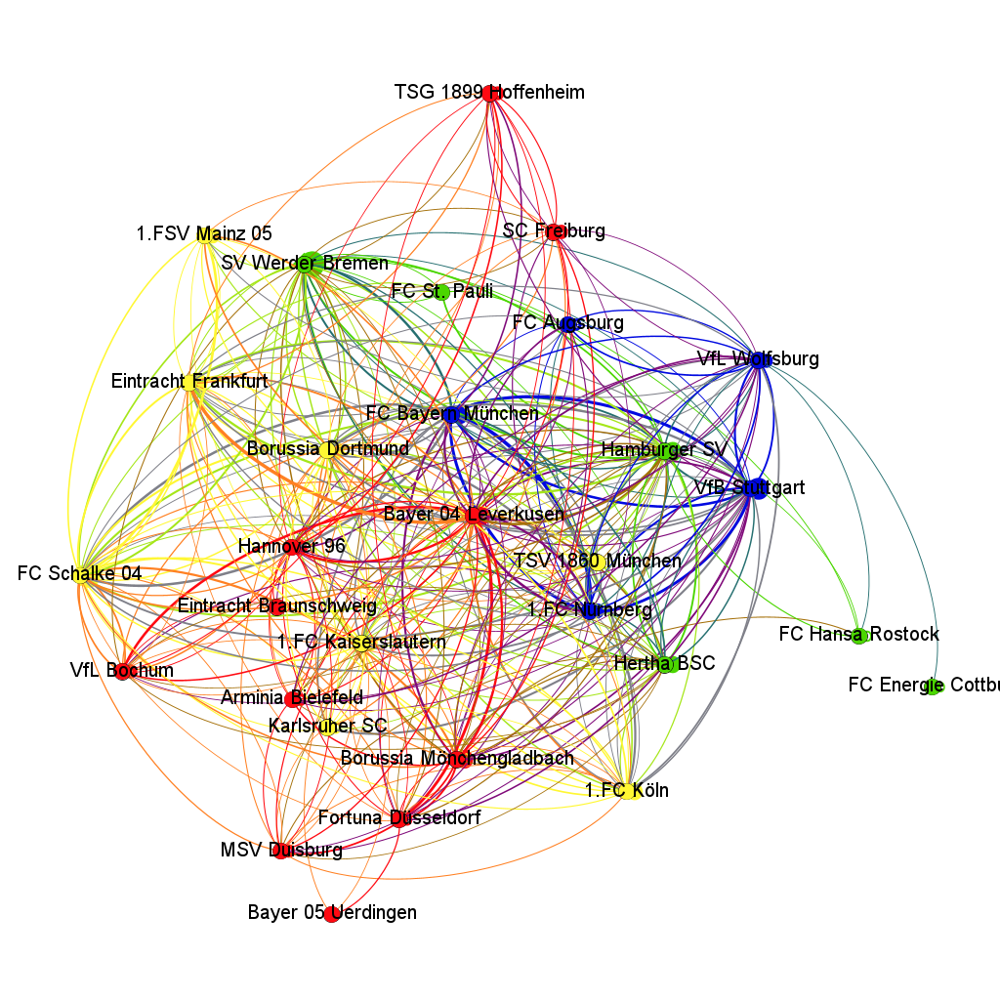

<!-- README.md is generated from README.Rmd -->

```{r, echo = FALSE}
knitr::opts_chunk$set(
  collapse = TRUE,
  comment = "#>",
  fig.path = "README-"
)
```

# German Football transfer network

Football clubs in Germany are part of a wider European and international transfer network. Players are traded across countries and continents These relationships can be interpreted as a social network suited for social network analysis. 
This project fetches all transfers tracked on a German football website and prepares them for visualization in Gephi (gephi.org). 

## Scraping Data and preparing it for analysis in Gephi

Data scraping and wrangling is done in the main file in R. This produces a structured table containing all transfers from the before specified years of the highest German football league, the Bundesliga. 
The main variables of interest here are the origin and target club names of each transfer. These club names become the nodes in the following network analysis. For each pair (dyad) of clubs (A and B), there are three possibilities for how they are connected: (1) no connection exist between them, or (2) there are only connections from A to B, meaning that only A traded players to B, or (3) there are connections in both directions, meaning that at least one player moved from A to B and vice versa. The transfers thereby become the edges in our network analysis. Their weight is determined by the number of transfers that have occurred in each direction. 

## Visualization in Gephi

The German football transfer network from 1963 to 2019 shows that more than 1700 clubs were involved in transfers with the clubs of the highest German football league. In sum, more than 8000 transfers are documented. 
To better understand the nature of this network it is useful to visualize it via Gephi. 



This Graph shows the 30 most actively trading clubs over the whole history of the Bundesliga, layouted by the ForceAtlas2 Algorithm. Clubs which are densely connected are painted in the same color by the modularity class algorithm implemented in gephi.

The network reveals some patterns which are well-known from social networks in general. For example, a considerable share of actors (clubs) have only very few connections. In fact, roughly two thirds of all clubs have only one in- or outcoming transfer. This may point to the importance of those numerous small clubs, from which young talents are recruited into the Bundesliga.
Some features of the data are nevertheless relatively unique for football transfers. The top30 strongest connections are recursive ones. This means, that players switched from one club to the same club. These transfers were most likely transfers between a youth division ("U19" for under 19, "U21" etc.) or the second team to the main team of a club. If these are ignored, the strongest connections are those between Bayern Munich and 1.FC Nuremberg followed by Bayer 04 Leverkusen and Eintracht Frankfurt. 

The data set allows many other insights. Investigating geographic trading patterns, money transfers between clubs (transfer fees are included when known) up to the transfer history of single players (player names are included) are only some starting points.


